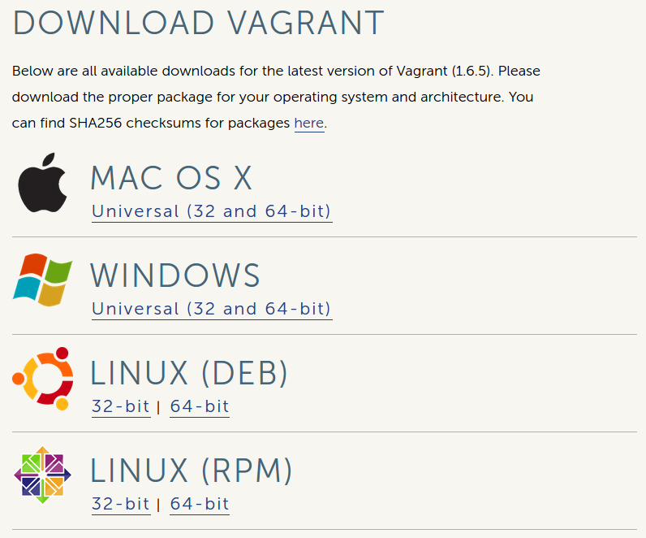
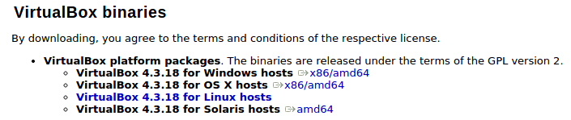

:title: Vagrant + Chef-Solo
:author: Fernando Espíndola
:description: Hands-on demonstration of vagrant and chef-solo
:css: vagrant.css

----

Vagrant and Chef-Solo
=====================

.. image:: images/vagrant-logo.gif
    :height: 250px

.. image:: images/chef-logo.png
    :height: 250px

----

:data-x: r+1100
:data-y: 0

Painel da Bolsa Project
=======================

Demo: http://www.paineldabolsa.com.br

+---------------------------------------+-----------------------------------------+
| .. image:: images/nginx-logo.jpg      |  .. image:: images/redis-logo.png       |
|         :width: 300px                 |          :width: 300px                  |
+---------------------------------------+-----------------------------------------+
| .. image:: images/python-logo.jpg     |  .. image:: images/virtualenv-logo.gif  |
|         :width: 300px                 |          :width: 200px                  |
+---------------------------------------+-----------------------------------------+
| .. image:: images/django-logo.png                                               |
|         :width: 300px                                                           |
+---------------------------------------------------------------------------------+

https://github.com/fernandoe/paineldabolsa-server

.. note::

    git clone https://github.com/fernandoe/paineldabolsa-server

----

Get and Install Vagrant
=======================

.. code:: bash

    $ vagrant --version
    Vagrant 1.6.5

https://www.vagrantup.com/downloads.html

.. note::

    * Check version: vagrant --version

----

Install VirtualBox
==================

.. image:: images/virtualbox-logo.png
    :width: 80px

.. code:: bash

    $ sudo apt-get install virtualbox

    $ vboxmanage --version
    4.3.10_Ubuntur93012

----

Project Setup
=============

.. code:: bash

    $ vagrant init

This command will create a *Vagrant* file with the minimun required configuration.

Boxes: http://www.vagrantbox.es

.. note::

    The primary function of the Vagrantfile is to describe the type of machine required for a project, and how to configure and provision these machines.

    - Remove comments
    
    config.vm.box     = "precise32"

    config.vm.box_url = "http://files.vagrantup.com/precise32.box"

----

Up and Running
==============

.. code:: bash

    $ vagrant up

----

Other Commands
==============

.. code:: bash

    $ vagrant status
    $ vagrant ssh
    $ vagrant destroy

----

:data-x: r+0
:data-y: r+1100

Vagrant Plugins
===============

Install the following plugins

.. code:: bash

    $ vagrant plugin install vagrant-omnibus
    $ vagrant plugin install vagrant-proxyconf

Add to the *Vagrantfile*

.. code:: ruby

    # config.omnibus.chef_version = :latest
    config.omnibus.chef_version = "11.16.4"

    config.proxy.http  = "http://proxy:port/"
    config.proxy.https = "http://proxy:port/"

----

Provisioning
============

    * **Chef (Chef-Solo)**

    * Puppet
    
    * Shell

    * Etc.

https://docs.vagrantup.com/v2/provisioning/index.html

----

Chef-Solo
=========

Cookbook
--------

    * unit of configuration for distribution

    * scenarios (components that are required)

    * Chef maintains a collection of cookbooks

https://community.opscode.com/cookbooks-directory

----

Chef-Solo
=========

Installation
------------

.. code:: bash

    # curl -L https://www.opscode.com/chef/install.sh | bash
    # chef-solo --version
    Chef: 11.16.4

----

Chef-Solo
=========

Initial Chef Configuration
--------------------------

.. code:: bash

    $ wget http://github.com/opscode/chef-repo/tarball/master
    $ tar -zxf master
    $ mv opscode-chef-repo* chef-repo
    $ rm master

.. note::

    $ cd chef-repo

    $ ls

    Resource: http://gettingstartedwithchef.com/

----

Knife Configuration
===================

.. code:: bash

    $ mkdir .chef
    $ echo "cookbook_path [ 'cookbooks' ]" > .chef/knife.rb

.. note::
    
    * Add to the file: .chef/knife.rb

        * http_proxy "http://proxy:port"
    
        * https_proxy "http://proxy:port"

----

Getting Cookbooks
=================

Our first Chef cookbook
-----------------------

**apt**
-------

.. code:: bash

    $ knife cookbook site download apt
    $ tar zxf apt*
    $ rm apt*.tar.gz

----

:data-x: r-1100
:data-y: r+0

Getting Cookbooks
=================

**python**
----------

.. code:: bash

    $ knife cookbook site download python
    $ tar zxf python*
    $ rm python*.tar.gz

----

Getting Cookbooks
=================

**redis**
---------

.. code:: bash

    $ knife cookbook site download redis
    $ tar zxf redis*
    $ rm redis*.tar.gz

----

Getting Cookbooks
=================

**nginx**
---------

.. code:: bash

    $ knife cookbook site download nginx
    $ tar zxf nginx*
    $ rm nginx*.tar.gz

----

Getting Cookbooks
=================

**supervisor**
--------------

.. code:: bash

    $ knife cookbook site download supervisor
    $ tar zxf supervisor*
    $ rm supervisor*.tar.gz

----

Creating Cookbooks
==================

**paineldabolsa**
-----------------

.. code:: bash

    $ knife cookbook create paineldabolsa

cookbook
--------

.. code:: ruby

    template "#{node.nginx.dir}/sites-available/paineldabolsa.conf" do
      source "nginx-paineldabolsa.conf.erb"
      mode "0644"
    end

    nginx_site "paineldabolsa.conf"

    template "/etc/supervisor.d/paineldabolsa.conf" do
      source "supervisor-paineldabolsa.conf.erb"
      mode "0644"
    end

----

Add Cookbooks to Vagrant
========================

.. code:: ruby

    config.vm.provision :chef_solo do |chef|
      chef.cookbooks_path = "chef-repo/cookbooks"
      chef.data_bags_path = "chef-repo/data_bags"
      chef.add_recipe "apt"
      chef.add_recipe "python"
      chef.add_recipe "redis::install_from_package"
      chef.add_recipe "nginx"
      chef.add_recipe "supervisor"
      chef.add_recipe "paineldabolsa"
    end

----

Get Dependencies
================

.. code:: bash

    # Dependencies for ...
    $ knife cookbook site download runit
    $ knife cookbook site download install_from
    $ knife cookbook site download metachef
    $ tar zxf runit*

    # Dependencies for ...
    $ knife cookbook site download build-essential
    $ knife cookbook site download yum
    $ knife cookbook site download yum-epel

    # Dependencies for nginx
    $ knife cookbook site download ohai
    $ knife cookbook site download bluepill
    $ knife cookbook site download rsyslog

- Two more things...

----

Synced Folders
==============

.. code:: ruby

    config.vm.synced_folder ".", "/vagrant", id: "vagrant-root", disabled: true
    config.vm.synced_folder ".", "/paineldabolsa", create: true

https://docs.vagrantup.com/v2/synced-folders/basic_usage.html

----

Networking
==========

forwarded ports
---------------

.. code:: ruby

    config.vm.network :forwarded_port, host: 8001, guest: 80
    config.vm.network :forwarded_port, host: 8002, guest: 8000
    config.vm.network :forwarded_port, host: 8003, guest: 9000

https://docs.vagrantup.com/v2/networking/forwarded_ports.html

----

Putting it all together
=======================

.. code:: bash

    $ vagrant up

.. note::

    When used behind a proxy, you should press Ctrl+C and restart the process using vagrant reload.
    #1 try: 10 minutes nd broke.

----

Providers
=========

https://github.com/mohitsethi/vagrant-hp

.. image:: images/hp-helion-logo.png
    :height: 130px

https://github.com/mitchellh/vagrant-aws

.. image:: images/aws-logo.png
    :height: 130px

----

AWS Provider
============

Installing
----------

.. code:: bash

    $ vagrant plugin install vagrant-aws

Using
-----

.. code:: bash

    $ vagrant up --provider=aws

----

Questions?
==========

----

:data-x: 800
:data-y: 4000
:data-scale: 15
:data-rotate-z: 0
:data-rotate-x: 180
:data-rotate-y: 0
:data-z: 0

Thank you!
===========
Fernando Espíndola
------------------

+------------------------------------+-----------------------------------------+
| .. image:: images/gmail-logo.jpg   |  fer.esp@gmail.com                      |
|         :height: 20px              |                                         |
+------------------------------------+-----------------------------------------+
| .. image:: images/twitter-logo.jpg | `@feresp <https://twitter.com/feresp>`_ |
|         :height: 35px              |                                         |
+------------------------------------+-----------------------------------------+

On Github 
---------
https://github.com/fernandoe/training-vagrant
https://github.com/fernandoe/paineldabolsa-server
